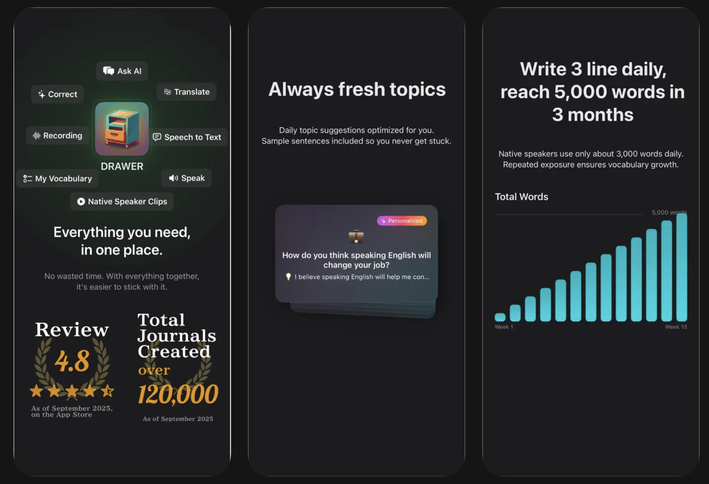
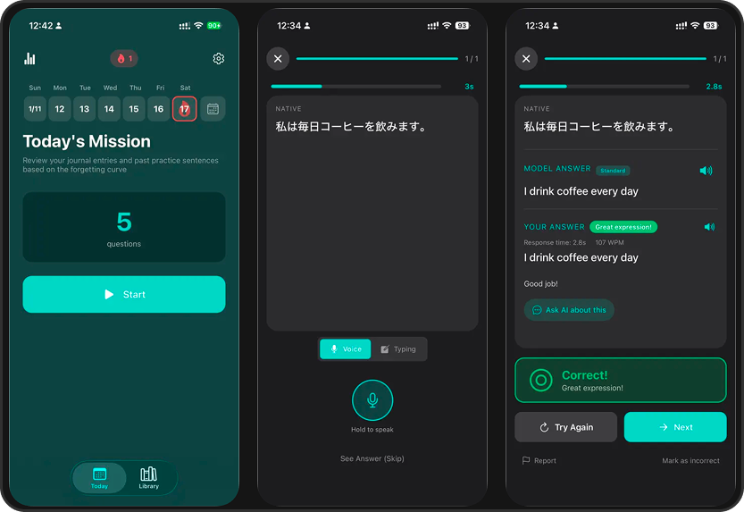

# Yuto Nakano

I own the full product lifecycle. I build products at the intersection of engineering, design, and growth.

Co-founder at TORICO Inc. Currently building [DRAWER](https://drawer-app.com/en/lp) — an AI language journal with 100K+ downloads.

---

## Projects

**[DRAWER — AI Language Journal](https://apps.apple.com/us/app/drawer-ai-language-journal/id6477773114)**

An AI-powered journaling app for language learners. Write about your day, get instant corrections, build a real habit.
100K+ downloads · 4.8 · iOS & Android

**[Shunsaku — Flashcards for Language Output](https://apps.apple.com/us/developer/yuto-nakano/id1448624818)**

3-minute daily language speaking practice.
App Store #152 in Education

---

[LinkedIn](https://www.linkedin.com/in/yuto-nakano44) · [@yuto_nakano44](https://x.com/yuto_nakano44)
